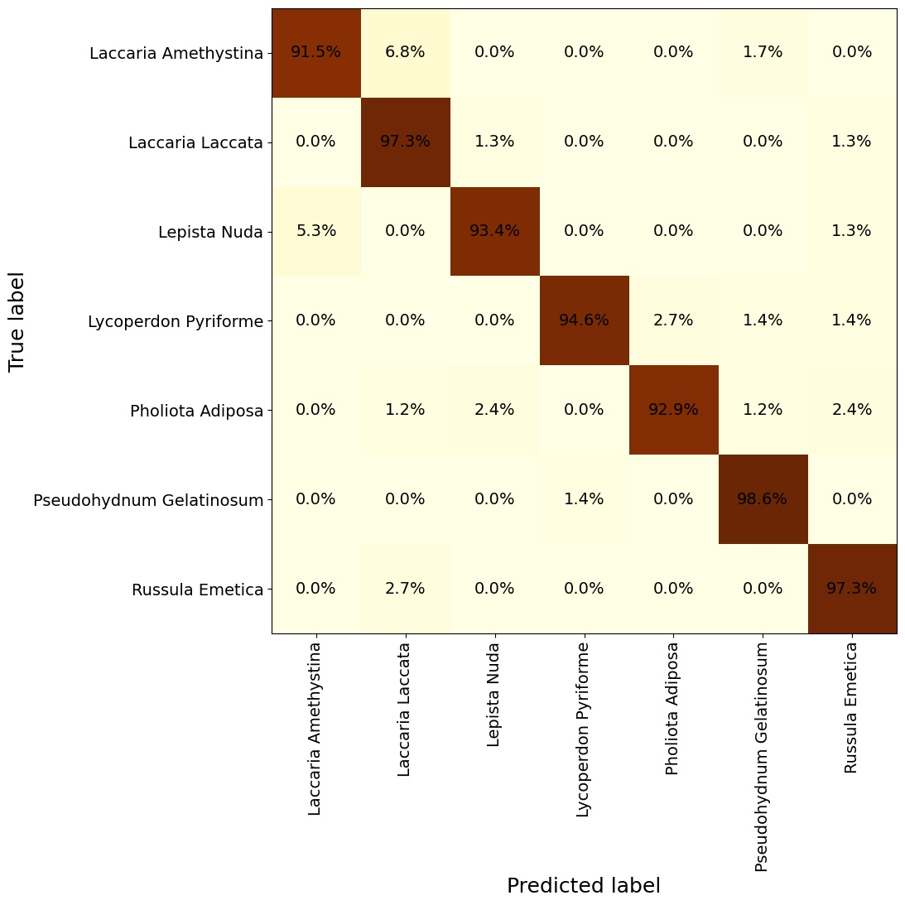

# Shroom_ID classification

#### ______________ Initial results _____________________

##### 7 random class model with EffNetB3 (transfer learning):

* >95% accuracy

* >90% accuracy across all classes using validation set

* Lowest performing classes are as a result of other species varieties.

A 150+ class model is likely to have comparibly much worse results, however there are several avenues for improvement:

* training the model from scratch will allow better feature recognition
* using larger models (efficientnetv2 looks best)
* Combining species varieties, where safe and appropriate to do so
